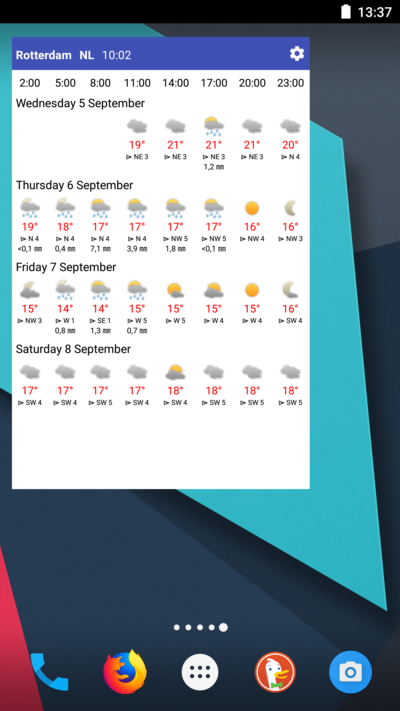
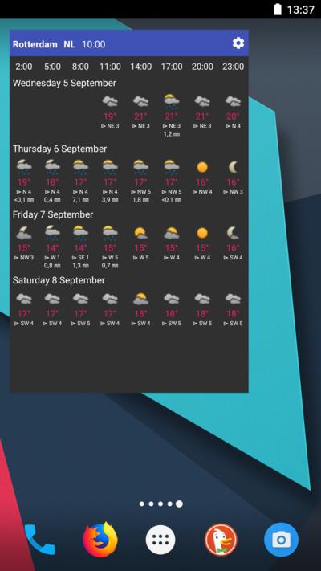
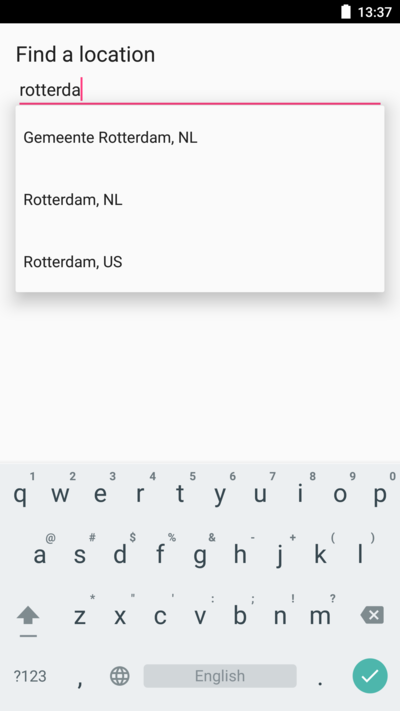
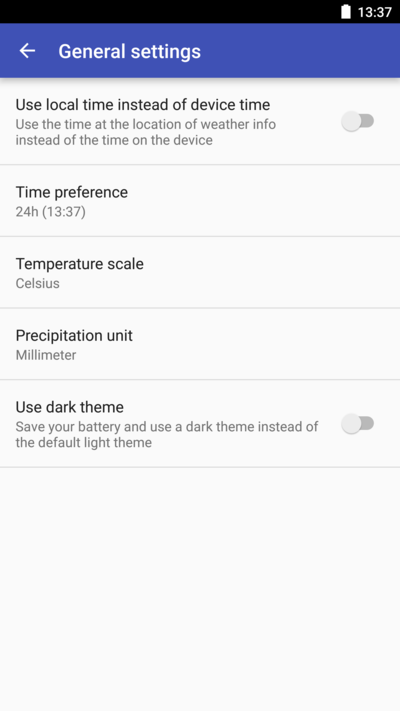

# Weather Widget

Add one or more widgets to your homescreen with 4 to 6 day weather forecasts in selected locations. Each day
is split into blocks of three hours and the information included in each forecast are:
- weather icon indicating sunshine, clouds and precipitation
- temperature (Kelvin, Celcius or Fahrenheit)
- wind direction
- wind speed (Beaufort)
- amount of rain (mm or inch)
- amount of snow (mm or inch)

The source of the forecasts is [OpenWeatherMap](https://openweathermap.org/) and is refreshed every half hour or when one of the widgets is
tapped. Temperature can be displayed in one of three scales: Kelvin, Celcius or Farenheit and is shown in blue
when temperature is below freezing and red otherwise. Rain and snow forecasts can be displayed in mm or inches.

The times of the blocks can either be of the forecast location itself or the location of the phone and can be
shown in 24-hour format of am/pm-format.

A widget has a minimal size of 4 x 3 and can be larger. When a widget is larger, more forecasts will fit. It is
possible to change the location after adding a widget by tapping the gear icon.

This app is available in English, Dutch, German and Chinese.

Weather icons thanks to (MerlinTheRed)[https://www.deviantart.com/merlinthered/art/plain-weather-icons-157162192]

## Screenshots

### Home screen widget

### Config screen of widget

### Settings screen of app

